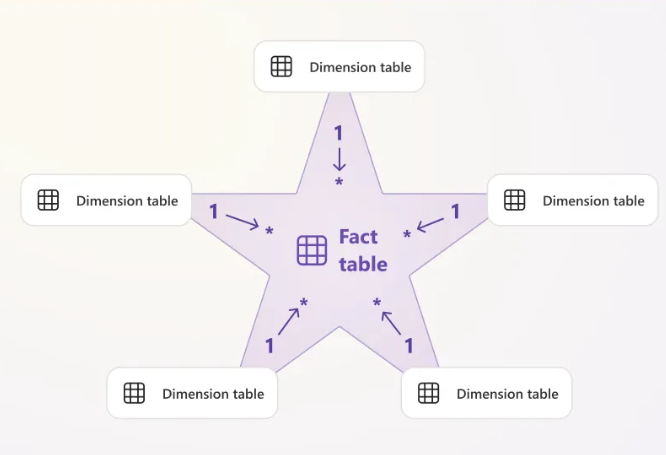
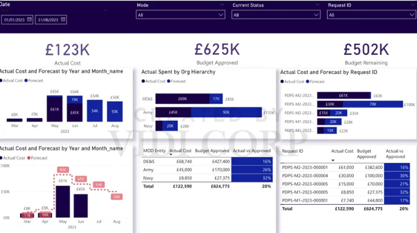

# Introducción a Power BI

* Programa que nos permite realizar tableros informativos.
* Sirve: Comunicar datos de manera visual --> destinado para los que toman las decisiones. 
* Harás hacer que tus datos hablen.
* Los tableros deben ser fáciles de asimilar y visualizar.
* Sin exceso de diseño.

---

Para PBI los exceles son como carpetas, y las pestañas son como tablas.


---

### Quieres un buen nivel en excel

1. Macros y visual basic
2. Power Query
3. Access**
4. Tableros

---

## Cronología

1. Subimos el excel con uno de los dos botones disponibles.

2. Una arriba el excel, sale una ventana nueva con tres botones

* Cargar: subir los datos ya a nuestro entorno de trabajo
* Transformar: Power Query (pre-procesamiento). No uses PQ en Power BI.

* Personal: PBI solo diseño y presentación.

* PBI: 1) PQ, 2) DAX

3. Tres tipos de datos
* Sin simbolito es entonces un string
* $\Sigma$ columna numérica
* Calendario: Columna Fecha

4. Vista de modelo ---> Modelo ---> SQL

* Modelo relacional - SQL.
* El modelo relación de tus datos.
* Entidad: tabla
* Conectar tus tablas por medio de relaciones. Llave primaria, foránea.
* Diagrama estrella-Óptimo para PBI.



5. Medida

Group By dinámico

Imagina que tienes un menú con 10 opciones de sucursal, cuando aprietas un botón de una sucursal, entonces en automática el valor de ``parametro_1`` cambia, lo mismo para ``parametro_2``.

Group by <--> funciones de agregación.

```sql
SELECT 
    Fecha,
    SUM(Total_Ticket) as Total_Ventas
FROM
    Ventas
WHERE
    Sucursal = parametro_1
AND
    Producto = parametro_2
GROUP BY
    Fecha
```

* Nos sirven, para el contexto del curso, para asociarlos a tarjetas.

* Cifras importantes, totales, promedios, mínimos, kpi's, etc.

6. Recomendaciones

* No más de 6 gráficos en tu tablero.
* Colores del lugar



* Trata de contar una historia

7. Fechas

* Por defecto se tiene una jerarquía de fechas.

8. Visualizaciones

* Creamos los gráficos
* Formatemaos los gráficos
* Lupa: prónostico

9. Medidas

* Son como fórmulas de Excel
* Se identifican con un símbolo de calculadora